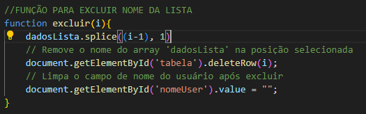

# Projeto de login e cadastro
Esse é um projeto em JavaScript para gerenciar o cadastro de usuários em uma lista. Ele contém uma tela de login e uma tela de cadastro, onde você pode adicionar, editar e excluir nomes de usuários.

# Funcionalidades
## Tela de Login

* Validação de Acesso:
* O usuário deve preencher ambos os campos de e-mail e senha para acessar a tela de cadastro.
* Caso algum campo esteja vazio, uma mensagem de alerta será exibida pedindo para preencher todos os campos.
## Tela de Cadastro

* Cadastro de Usuário:

* Permite ao usuário inserir um nome e adicioná-lo a uma lista.
* O nome do usuário é armazenado em um array.
#### Edição de Usuário:

* O nome de um usuário existente na lista pode ser editado. Ao clicar no botão "Editar", o nome selecionado é colocado no campo de input para que possa ser alterado.
#### Exclusão de Usuário:

* Usuários podem ser removidos da lista. Ao clicar no botão "Excluir", o nome selecionado é removido da lista e da tabela.

* Na tela de login colocamos o email e a senha para sermos direcionados a tela de cadastro.
Caso os requisitos não sejam atendidos, um alert será mostrado na tela.

## Funções

* Função acessar():

Responsável pela validação dos campos de e-mail e senha na tela de login. Redireciona o usuário para a página de cadastro se as credenciais estiverem preenchidas.

* Função salvarUser():

Armazena o nome do usuário no array dadosLista e chama a função criarlista() para atualizar a tabela com o novo nome. Se o campo de nome estiver vazio, exibe uma mensagem de alerta.

* Função criarlista():

Gera uma tabela HTML com os nomes armazenados no array dadosLista. Cada linha da tabela inclui botões para editar e excluir o nome do usuário.

* Função editar(i):

Permite a edição de um nome na lista. Remove o nome antigo do array e coloca-o no campo de input para edição.

* Função excluir(i):

Exclui um nome do array e remove a linha correspondente da tabela HTML.

## Fontes

https://developer.mozilla.org/pt-BR/docs/Web/JavaScript/Reference/Global_Objects/Array/splice 
https://chatgpt.com

## Autores
* Ricardo Siena